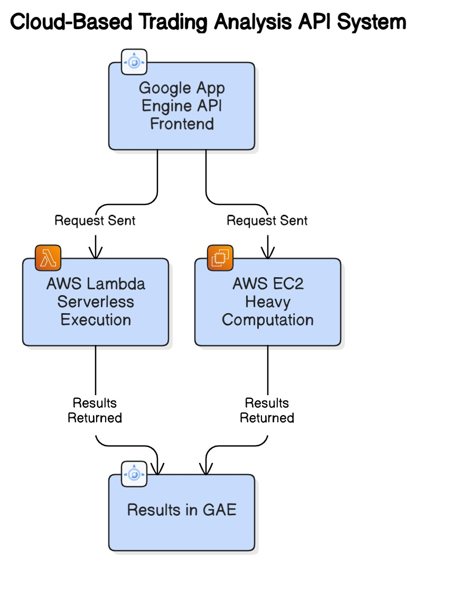

# Cloud API for Risk and Profitability Analysis in Trading Strategies  
(Multicloud Implementation - GAE + AWS Lambda + AWS EC2)

---

## Project Overview

This project implements a Cloud-Native API system for performing risk analysis and profitability checks of trading strategies based on financial data.

The API detects trading signals (like Three White Soldiers & Three Black Crows) from stock price history and runs Monte Carlo simulations to calculate the Value at Risk (VaR) and potential Profit/Loss.

The architecture dynamically allocates computational resources between AWS Lambda and AWS EC2 based on user input while Google App Engine (GAE) serves as the API frontend handling all user interactions and displaying final results.

---

## Input Composition (User Parameters for Analysis)

Users need to provide the following inputs to the `/analyse` endpoint:

| Parameter | Meaning | Example Value |
|-----------|---------|----------------|
| h         | Length of price history to calculate mean and standard deviation | 101 |
| d         | Number of Monte Carlo shots (data points to generate per signal) | 10000 |
| t         | Type of signal to analyze - `buy` or `sell` | buy / sell |
| p         | Days after signal to check Profit or Loss | 7 |

---

GAE makes the decision to route computation either to Lambda or EC2 based on user-specified scale parameters (r - number of parallel executions).

---

## Architecture 

### System Overview

This Cloud-based Risk Analysis API is built using a Multi-Cloud Architecture that integrates:

- Google App Engine (GAE) for API Management and User Interaction
- AWS Lambda for Fast, Lightweight Computations
- AWS EC2 for Heavy, Resource-Intensive Computations

The architecture is designed to be scalable, cost-effective, and dynamically allocate resources based on user input.

---

## Architecture Flow Description

### 1. API Frontend - Google App Engine (GAE)

- All user requests are sent to the REST API hosted on GAE.
- GAE handles:
  - Input validation
  - Routing of requests
  - Response formatting
  - Displaying final results to the user
- The user interacts with GAE through different API endpoints like `/warmup`, `/analyse`, `/get_sig_vars9599`, `/get_tot_profit_loss`, etc.

---

### 2. Dynamic Resource Allocation Logic

GAE dynamically selects the backend service based on the user's selection of:

- `s` → Service to use (`lambda` or `ec2`)
- `r` → Number of parallel executions required for the analysis

GAE routes the request to:

- AWS Lambda — If the task is lightweight, requires faster response, and less resource-heavy.
- AWS EC2 — If the task is resource-intensive, involves large data, or higher computation is needed.

---

### 3. Backend Computation

Once the backend is selected:

- AWS Lambda or AWS EC2 performs the core computation using Monte Carlo Simulations to calculate:
  - 95% and 99% Value at Risk (VaR)
  - Profit or Loss after a certain number of days from trading signals
- The required stock data (OHLC data) is fetched from Yahoo Finance.

---

### 4. Results Returned to GAE

- The computed results (risk values, profit/loss, and charts) are sent back to GAE.
- GAE collects, averages, and formats the results.
- GAE provides the results to the user via different GET endpoints.

---

The below diagram represents the overall architecture of the Cloud-Based Risk Analysis API System.

- The user interacts with the API hosted on Google App Engine (GAE).
- Based on user input, GAE routes the request to either:
  - AWS Lambda (for fast and lightweight computation)
  - AWS EC2 (for heavy and resource-intensive computation)
- The result is returned to GAE and displayed to the user.

## API Endpoints Provided

| Endpoint | Method | Purpose | Input / Output |
|----------|--------|---------|----------------|
| /warmup | POST | Prepare and allocate resources based on user's choice of service (`lambda` or `ec2`) and parallelism `r` | Input: `{s: lambda, r: 3}` Output: `{result: ok}` |
| /scaled_ready | GET | Check whether resources have been warmed up and ready | Output: `{warm: true}` or `{warm: false}` |
| /get_warmup_cost | GET | Get time and cost taken for warmup | Output: `{billable_time: 227.44, cost: 18.33}` |
| /get_endpoints | GET | Get all relevant API call strings for each warmed-up service | Output: Array of endpoint call strings |
| /analyse | POST | Perform Risk and Profitability Analysis | Input: `{h:101, d:10000, t:sell, p:7}` Output: `{result: ok}` |
| /get_sig_vars9599 | GET | Get 95% and 99% VaR values for each signal | Output: `{var95: [...], var99:[...]}` |
| /get_avg_vars9599 | GET | Get average VaR values over all signals | Output: `{var95: value, var99: value}` |
| /get_sig_profit_loss | GET | Profit/Loss value for each signal | Output: `{profit_loss: [...]}` |
| /get_tot_profit_loss | GET | Total Profit or Loss | Output: `{profit_loss: value}` |
| /get_chart_url | GET | URL of risk chart generated | Output: `{url: ...}` |
| /get_time_cost | GET | Get total analysis time and cost | Output: `{time: value, cost: value}` |
| /get_audit | GET | Historical log of all previous analyses done | Output: List of previous runs with parameters and results |
| /reset | GET | Reset system state for next analysis without releasing resources | Output: `{result: ok}` |
| /terminate | GET | Terminate resources to avoid cost | Output: `{result: ok}` |
| /scaled_terminated | GET | Check whether all resources have been terminated | Output: `{terminated: true}` or `{terminated: false}` |

---

## Data Source

Historical OHLC (Open, High, Low, Close) stock price data is fetched from Yahoo Finance.

## Technologies Used

- Google App Engine (API Frontend)
- AWS Lambda (Serverless Computation)
- AWS EC2 (Heavy Data Processing)
- Python
- Pandas
- Yahoo Finance API
- Monte Carlo Simulations
- REST API Architecture

## Results and Performance Analysis

The Cloud Risk Analysis API was tested by varying the number of parallel executions (`r`) and the number of Monte Carlo shots (`d`) to observe its performance, execution time, and cost across AWS Lambda and EC2.

---

### Execution Time vs Cost Observed

| Parallel Runs (r) | Monte Carlo Shots (d) | Warmup Cost ($) | Execution Cost ($) | Execution Time (ms) |
|------------------|------------------------|-----------------|---------------------|---------------------|
| 3                | 10000                  | 0.0000006       | 0.000018            | 9.87                |
| 3                | 30000                  | 0.0000006       | 0.000058            | 28.97               |
| 5                | 30000                  | 0.000001        | 0.000058            | 29.24               |

---

### Observations:

- AWS Lambda handled small to moderate simulations quickly with minimal cost.
- AWS EC2 was selected for higher `d` values (larger simulations).
- Execution time increased linearly with the number of shots `d`.
- The dynamic resource allocation between Lambda and EC2 helped optimize performance and cost.

---

## Cost Considerations

| Cloud Service | Cost Details                      |
|---------------|-----------------------------------|
| Google App Engine (GAE) | $0.04 per instance hour |
| AWS Lambda    | $0.00001667 per GB-second        |
| AWS EC2 (t2.micro) | $0.0116 per instance hour   |

> Note: Costs are based on AWS and GCP pricing models at the time of testing and may vary slightly.

---

