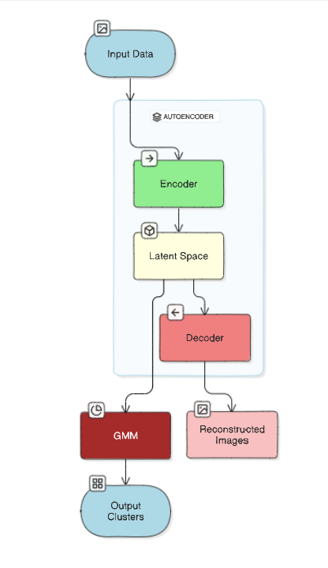

# Unsupervised Clustering of High-Dimensional Image Data: Integrating Autoencoders with Gaussian Mixture Models (GMM)

## Project Overview
This project explores a novel approach to unsupervised image clustering by integrating ResNet-18 based autoencoders with Gaussian Mixture Models (GMM). The approach focuses on compressing high-dimensional image data into meaningful latent spaces and clustering them effectively using GMM.

This repository contains the complete code, images, and necessary resources used for the dissertation:

> *"Unsupervised Clustering of High-Dimensional Image Data: Integrating Autoencoders with Gaussian Mixture Models"*

---

---

## Dataset
Dataset used in this project was sourced from Kaggle:

[CIFake Dataset (Real and AI Generated Images)](https://www.kaggle.com/datasets/birdy654/cifake-real-and-ai-generated-synthetic-images)

---

## Project Components & Explanation

### 1. Autoencoder Architecture

ResNet-18 based Autoencoder was designed to reduce the dimensionality of input images while preserving critical features for clustering.

#### ResNet18 Architecture Diagram:


#### ResNet18 Autoencoder Architecture:


---

### 2. Dataset Samples

#### Real Images Samples:


#### Fake/Simulated Images Samples:


---

### 3. Model Performance & Evaluation

#### Training Loss Over Epochs:
Comparison of Original vs Reconstructed Images after Autoencoder Training.


---

#### Latent Space Representations:
Original Images vs their Encoded Representations.


---

#### GMM Clustering Results:

##### Real Data Points and their Cluster Means Identified by GMM:


---

#### Scatter Plot Showing Clusters for Real Data:


---

## Architecture Flow Overview

Architecture Flow Diagram for Autoencoder and GMM Integration:



---

## Code

The complete implementation is provided in the notebook:

- `Dissertationfinal.ipynb`

Open and run the notebook using:

```bash
jupyter notebook Dissertationfinal.ipynb

## Technologies Used

- Python
- PyTorch
- Scikit-learn
- Matplotlib
- ResNet18 Autoencoder
- Gaussian Mixture Model (GMM)
- t-SNE for Dimensionality Reduction

---

## Results Summary

- Efficient dimensionality reduction while preserving important features.
- Effective clustering of both real and simulated images.
- Evaluation using metrics like:
  - Bayesian Information Criterion (BIC)
  - Akaike Information Criterion (AIC)
  - KL Divergence
  - Reconstruction Loss
  - Visual Cluster Evaluation


